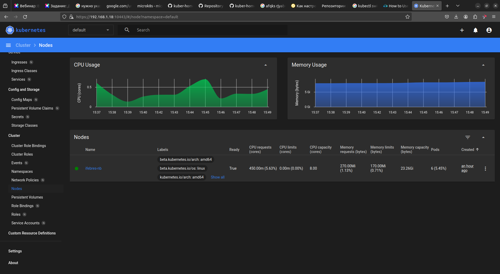
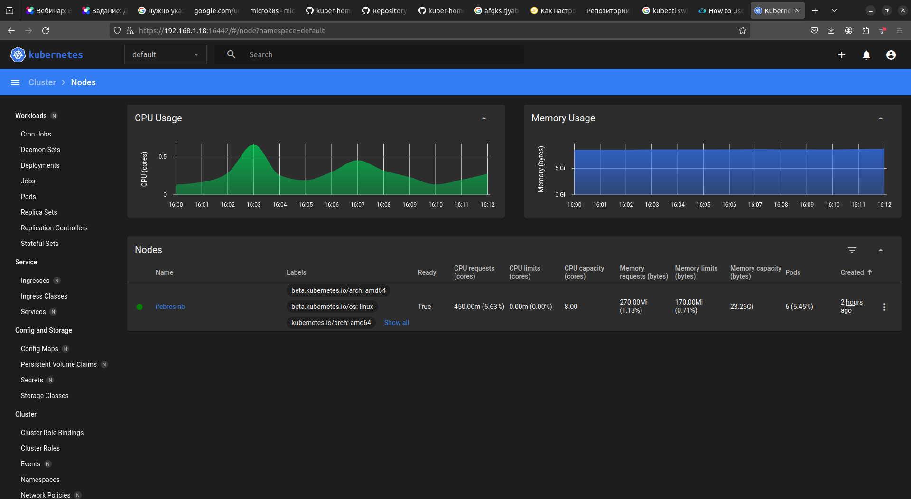

# Домашнее задание к занятию «Kubernetes. Причины появления. Команда kubectl»


### Задание 1. Установка MicroK8S

1. Установить MicroK8S на локальную машину или на удалённую виртуальную машину.  
```commandline
ifebres@ifebres-nb:~$ microk8s status --wait-ready
microk8s is running
high-availability: no
  datastore master nodes: 127.0.0.1:19001
  datastore standby nodes: none
addons:
  enabled:
    dns                  # (core) CoreDNS
    ha-cluster           # (core) Configure high availability on the current node
    helm                 # (core) Helm - the package manager for Kubernetes
    helm3                # (core) Helm 3 - the package manager for Kubernetes
  disabled:
    cert-manager         # (core) Cloud native certificate management
    cis-hardening        # (core) Apply CIS K8s hardening
    community            # (core) The community addons repository
    dashboard            # (core) The Kubernetes dashboard
    gpu                  # (core) Alias to nvidia add-on
    host-access          # (core) Allow Pods connecting to Host services smoothly
    hostpath-storage     # (core) Storage class; allocates storage from host directory
    ingress              # (core) Ingress controller for external access
    kube-ovn             # (core) An advanced network fabric for Kubernetes
    mayastor             # (core) OpenEBS MayaStor
    metallb              # (core) Loadbalancer for your Kubernetes cluster
    metrics-server       # (core) K8s Metrics Server for API access to service metrics
    minio                # (core) MinIO object storage
    nvidia               # (core) NVIDIA hardware (GPU and network) support
    observability        # (core) A lightweight observability stack for logs, traces and metrics
    prometheus           # (core) Prometheus operator for monitoring and logging
    rbac                 # (core) Role-Based Access Control for authorisation
    registry             # (core) Private image registry exposed on localhost:32000
    rook-ceph            # (core) Distributed Ceph storage using Rook
    storage              # (core) Alias to hostpath-storage add-on, deprecated

```

2. Установить dashboard.
```commandline
ifebres@ifebres-nb:~$ microk8s enable dashboard
Infer repository core for addon dashboard
Enabling Kubernetes Dashboard
Infer repository core for addon metrics-server
Enabling Metrics-Server
serviceaccount/metrics-server created
clusterrole.rbac.authorization.k8s.io/system:aggregated-metrics-reader created
clusterrole.rbac.authorization.k8s.io/system:metrics-server created
rolebinding.rbac.authorization.k8s.io/metrics-server-auth-reader created
clusterrolebinding.rbac.authorization.k8s.io/metrics-server:system:auth-delegator created
clusterrolebinding.rbac.authorization.k8s.io/system:metrics-server created
service/metrics-server created
deployment.apps/metrics-server created
apiservice.apiregistration.k8s.io/v1beta1.metrics.k8s.io created
clusterrolebinding.rbac.authorization.k8s.io/microk8s-admin created
Metrics-Server is enabled
Applying manifest
serviceaccount/kubernetes-dashboard created
service/kubernetes-dashboard created
secret/kubernetes-dashboard-certs created
secret/kubernetes-dashboard-csrf created
secret/kubernetes-dashboard-key-holder created
configmap/kubernetes-dashboard-settings created
role.rbac.authorization.k8s.io/kubernetes-dashboard created
clusterrole.rbac.authorization.k8s.io/kubernetes-dashboard created
rolebinding.rbac.authorization.k8s.io/kubernetes-dashboard created
clusterrolebinding.rbac.authorization.k8s.io/kubernetes-dashboard created
deployment.apps/kubernetes-dashboard created
service/dashboard-metrics-scraper created
deployment.apps/dashboard-metrics-scraper created
secret/microk8s-dashboard-token created

If RBAC is not enabled access the dashboard using the token retrieved with:

microk8s kubectl describe secret -n kube-system microk8s-dashboard-token

Use this token in the https login UI of the kubernetes-dashboard service.

In an RBAC enabled setup (microk8s enable RBAC) you need to create a user with restricted
permissions as shown in:
https://github.com/kubernetes/dashboard/blob/master/docs/user/access-control/creating-sample-user.md
```
- генерируем токен
```commandline
ifebres@ifebres-nb:~$ microk8s kubectl describe secret -n kube-system microk8s-dashboard-token
Name:         microk8s-dashboard-token
Namespace:    kube-system
Labels:       <none>
Annotations:  kubernetes.io/service-account.name: default
              kubernetes.io/service-account.uid: bcceae48-9102-4ff4-83fe-96ffe8aee8d1

Type:  kubernetes.io/service-account-token

Data
====
ca.crt:     1123 bytes
namespace:  11 bytes
token:      

```
3. Сгенерировать сертификат для подключения к внешнему ip-адресу.  

```commandline
ifebres@ifebres-nb:/var/snap/microk8s/current/certs$ cat  csr.conf.template 
[ req ]
default_bits = 2048
prompt = no
default_md = sha256
req_extensions = req_ext
distinguished_name = dn

[ dn ]
C = GB
ST = Canonical
L = Canonical
O = Canonical
OU = Canonical
CN = 127.0.0.1

[ req_ext ]
subjectAltName = @alt_names

[ alt_names ]
DNS.1 = kubernetes
DNS.2 = kubernetes.default
DNS.3 = kubernetes.default.svc
DNS.4 = kubernetes.default.svc.cluster
DNS.5 = kubernetes.default.svc.cluster.local
IP.1 = 127.0.0.1
IP.2 = 10.152.183.1
IP.3 = 192.168.1.18
#MOREIPS

[ v3_ext ]
authorityKeyIdentifier=keyid,issuer:always
basicConstraints=CA:FALSE
keyUsage=keyEncipherment,dataEncipherment,digitalSignature
extendedKeyUsage=serverAuth,clientAuth
subjectAltName=@alt_names

ifebres@ifebres-nb:~$ sudo microk8s refresh-certs --cert front-proxy-client.crt
Taking a backup of the current certificates under /var/snap/microk8s/6809/certs-backup/
Creating new certificates
Signature ok
subject=CN = front-proxy-client
Getting CA Private Key
Restarting service kubelite.

ifebres@ifebres-nb:~$ microk8s kubectl port-forward --address 192.168.1.18 -n kube-system service/kubernetes-dashboard 10443:443
Forwarding from 192.168.1.18:10443 -> 8443
Handling connection for 10443

```



------

### Задание 2. Установка и настройка локального kubectl
```commandline
ifebres@ifebres-nb:~/.kube$ kubectl config get-contexts 
CURRENT   NAME          CLUSTER            AUTHINFO   NAMESPACE
          microk8s      microk8s-cluster   admin      
*         prod-k8s      prod-k8s           i.febres   
          sandbox-k8s   sandbox-k8s        i.febres   
ifebres@ifebres-nb:~/.kube$ kubectl config use-context microk8s
Switched to context "microk8s".
ifebres@ifebres-nb:~/.kube$ kubectl get nodes
NAME         STATUS   ROLES    AGE    VERSION
ifebres-nb   Ready    <none>   115m   v1.29.4
```

Подключаемся к дашборду с помощью port-forward

```commandline
ifebres@ifebres-nb:~$ kubectl port-forward --address 192.168.1.18 -n kube-system service/kubernetes-dashboard 16442:443
Forwarding from 192.168.1.18:16442 -> 8443
Handling connection for 16442
```


------

