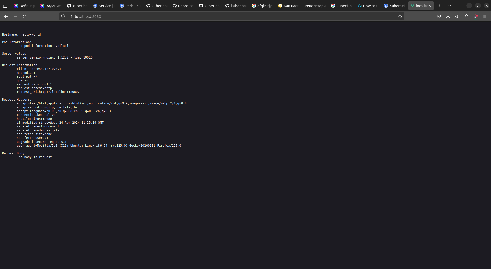
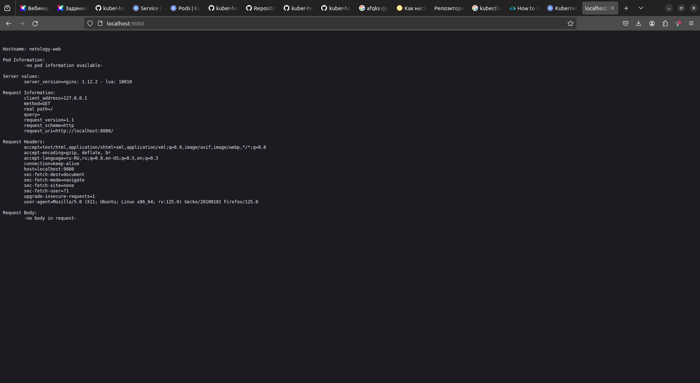

# Домашнее задание к занятию «Базовые объекты K8S»

### Задание 1. Создать Pod с именем hello-world

1. Манифест Pod.[hw.yaml](src%2Fhw.yaml)
2. Использовать image - gcr.io/kubernetes-e2e-test-images/echoserver:2.2.
3. Подключиться локально к Pod с помощью `kubectl port-forward` и вывести значение (curl или в браузере).
```commandline
ifebres@ifebres-nb:~/github/kuber-homeworks/1.2/src$ kubectl apply -f ./hw.yaml 
pod/hello-world created

ifebres@ifebres-nb:~/github/kuber-homeworks/1.2/src$ kubectl port-forward hello-world 8080:8080
Forwarding from 127.0.0.1:8080 -> 8080
Forwarding from [::1]:8080 -> 8080
```


------

### Задание 2. Создать Service и подключить его к Pod

1. Создать Pod с именем netology-web. [netology.yaml](src%2Fnetology.yaml)
2. Создать Service с именем netology-svc и подключить к netology-web.[service.yaml](src%2Fservice.yaml)
3. Подключиться локально к Service с помощью `kubectl port-forward` и вывести значение (curl или в браузере).
```commandline
ifebres@ifebres-nb:~/github/kuber-homeworks/1.2/src$ kubectl apply -f ./netology.yaml 
pod/netology-web created

ifebres@ifebres-nb:~/github/kuber-homeworks/1.2/src$ kubectl apply -f ./service.yaml 
service/netology-svc created

ifebres@ifebres-nb:~/github/kuber-homeworks/1.2/src$ kubectl get pods
NAME           READY   STATUS    RESTARTS   AGE
hello-world    1/1     Running   0          25m
netology-web   1/1     Running   0          2m7s

ifebres@ifebres-nb:~/github/kuber-homeworks/1.2/src$ kubectl port-forward svc/netology-svc 9080:80
Forwarding from 127.0.0.1:9080 -> 8080
Forwarding from [::1]:9080 -> 8080
Handling connection for 9080
```
