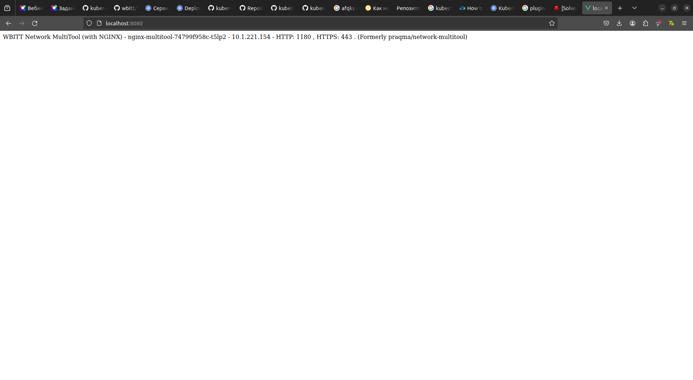

# Домашнее задание к занятию «Запуск приложений в K8S»

### Задание 1. Создать Deployment и обеспечить доступ к репликам приложения из другого Pod

1. Создать Deployment приложения, состоящего из двух контейнеров — nginx и multitool. [deployment1.yaml](src%2Fdeployment1.yaml)
2. После запуска увеличить количество реплик работающего приложения до 2.
```commandline
ifebres@ifebres-nb:~/github/kuber-homeworks/1.3/src$ kubectl get deployments
NAME               READY   UP-TO-DATE   AVAILABLE   AGE
multitool          0/1     1            0           25m
nginx-deployment   0/1     1            0           4m2s

ifebres@ifebres-nb:~/github/kuber-homeworks/1.3/src$ kubectl get pods 
NAME                               READY   STATUS    RESTARTS   AGE
nginx-multitool-77489bf7b4-pzdvc   2/2     Running   0          6m8s

ifebres@ifebres-nb:~/github/kuber-homeworks/1.3/src$ kubectl apply -f ./deployment1.yaml 
deployment.apps/nginx-multitool configured

ifebres@ifebres-nb:~/github/kuber-homeworks/1.3/src$ kubectl get pods 
NAME                               READY   STATUS    RESTARTS   AGE
nginx-multitool-77489bf7b4-d79gr   2/2     Running   0          10s
nginx-multitool-77489bf7b4-pzdvc   2/2     Running   0          7m46s
```
3. Создать Service, который обеспечит доступ до реплик приложений из п.1. [service1.yaml](src%2Fservice1.yaml)
```commandline
ifebres@ifebres-nb:~/github/kuber-homeworks/1.3/src$ kubectl get service
NAME           TYPE        CLUSTER-IP       EXTERNAL-IP   PORT(S)           AGE
kubernetes     ClusterIP   10.152.183.1     <none>        443/TCP           47h
netology-svc   ClusterIP   10.152.183.253   <none>        80/TCP,1180/TCP   32s

ifebres@ifebres-nb:~/github/kuber-homeworks/1.3/src$ kubectl port-forward svc/netology-svc 8080:1180
Forwarding from 127.0.0.1:8080 -> 1180
Forwarding from [::1]:8080 -> 1180
Handling connection for 8080
```

4. Создать отдельный Pod с приложением multitool и убедиться с помощью `curl`, что из пода есть доступ до приложений из п.1.
 [pod1.yaml](src%2Fpod1.yaml)
```commandline
ifebres@ifebres-nb:~/github/kuber-homeworks/1.3/src$ kubectl get pod
NAME                               READY   STATUS    RESTARTS   AGE
netology-multitool                 1/1     Running   0          15s
nginx-multitool-74799f958c-sm8p5   2/2     Running   0          6m41s
nginx-multitool-74799f958c-t5lp2   2/2     Running   0          6m44s

ifebres@ifebres-nb:~/github/kuber-homeworks/1.3/src$ kubectl exec -it netology-multitool /bin/sh
kubectl exec [POD] [COMMAND] is DEPRECATED and will be removed in a future version. Use kubectl exec [POD] -- [COMMAND] instead.
/ # curl netology-svc:80
<!DOCTYPE html>
<html>
<head>
<title>Welcome to nginx!</title>
<style>
    body {
        width: 35em;
        margin: 0 auto;
        font-family: Tahoma, Verdana, Arial, sans-serif;
    }
</style>
</head>
<body>
<h1>Welcome to nginx!</h1>
<p>If you see this page, the nginx web server is successfully installed and
working. Further configuration is required.</p>

<p>For online documentation and support please refer to
<a href="http://nginx.org/">nginx.org</a>.<br/>
Commercial support is available at
<a href="http://nginx.com/">nginx.com</a>.</p>

<p><em>Thank you for using nginx.</em></p>
</body>
</html>

# curl netology-svc:1180
WBITT Network MultiTool (with NGINX) - nginx-multitool-74799f958c-sm8p5 - 10.1.221.155 - HTTP: 1180 , HTTPS: 443 . (Formerly praqma/network-multitool)
```
------

### Задание 2. Создать Deployment и обеспечить старт основного контейнера при выполнении условий

1. Создать Deployment. [deployment2.yaml](src%2Fdeployment2.yaml)
2. Убедиться, что nginx не стартует. В качестве Init-контейнера взять busybox.
```commandline
febres@ifebres-nb:~/github/kuber-homeworks/1.3/src$ kubectl apply -f deployment2.yaml 
deployment.apps/nginx-deployment created
ifebres@ifebres-nb:~/github/kuber-homeworks/1.3/src$ kubectl get deployment
NAME               READY   UP-TO-DATE   AVAILABLE   AGE
nginx-deployment   0/1     1            0           14s
ifebres@ifebres-nb:~/github/kuber-homeworks/1.3/src$ kubectl get pod
NAME                                READY   STATUS     RESTARTS   AGE
nginx-deployment-6cf88688c4-x64xx   0/1     Init:0/1   0          26s
ifebres@ifebres-nb:~/github/kuber-homeworks/1.3/src$ kubectl get pod
NAME                                READY   STATUS     RESTARTS   AGE
nginx-deployment-6cf88688c4-x64xx   0/1     Init:0/1   0          78s
ifebres@ifebres-nb:~/github/kuber-homeworks/1.3/src$ kubectl get pod
NAME                                READY   STATUS     RESTARTS   AGE
nginx-deployment-6cf88688c4-x64xx   0/1     Init:0/1   0          3m10s
```
3. Создать и запустить Service. Убедиться, что Init запустился. [service2.yaml](src%2Fservice2.yaml)
```commandline
ifebres@ifebres-nb:~/github/kuber-homeworks/1.3/src$ kubectl get service
NAME         TYPE        CLUSTER-IP       EXTERNAL-IP   PORT(S)   AGE
kubernetes   ClusterIP   10.152.183.1     <none>        443/TCP   2d2h
nginx-svc    ClusterIP   10.152.183.115   <none>        80/TCP    16s
```
4. Продемонстрировать состояние пода до и после запуска сервиса.
```commandline
ifebres@ifebres-nb:~/github/kuber-homeworks/1.3/src$ kubectl get pod
NAME                                READY   STATUS    RESTARTS   AGE
nginx-deployment-6cf88688c4-x64xx   1/1     Running   0          5m19s
```

