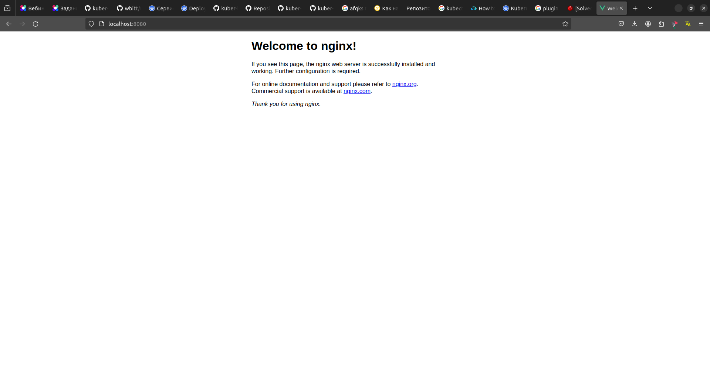
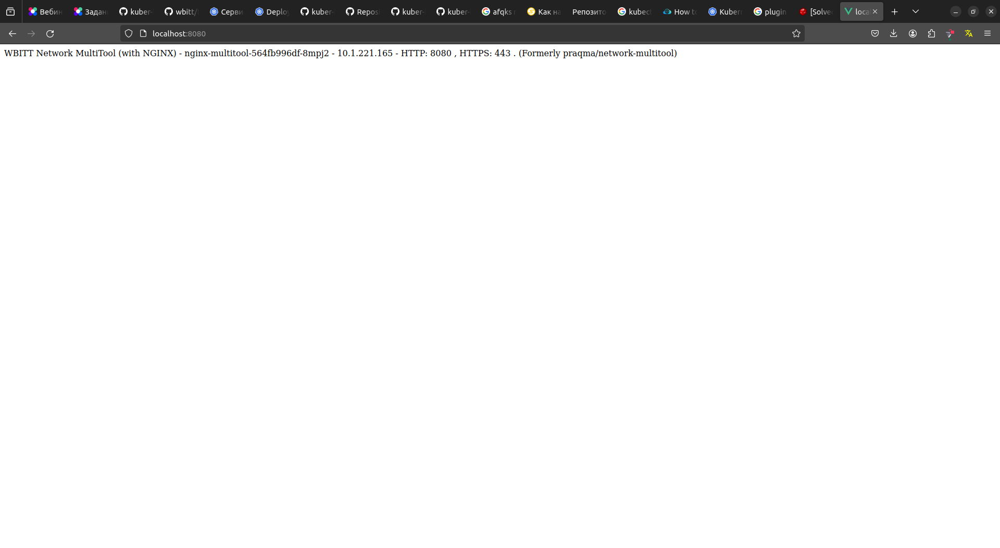

# Домашнее задание к занятию «Сетевое взаимодействие в K8S. Часть 1»

### Задание 1. Создать Deployment и обеспечить доступ к контейнерам приложения по разным портам из другого Pod внутри кластера

1. Создать Deployment приложения, состоящего из двух контейнеров (nginx и multitool), с количеством реплик 3 шт. [deployment1.yaml](src%2Fdeployment1.yaml)
2. Создать Service, который обеспечит доступ внутри кластера до контейнеров приложения из п.1 по порту 9001 — nginx 80, по 9002 — multitool 8080. [service1.yaml](src%2Fservice1.yaml)
3. Создать отдельный Pod с приложением multitool и убедиться с помощью `curl`, что из пода есть доступ до приложения из п.1 по разным портам в разные контейнеры. [pod1.yaml](src%2Fpod1.yaml)
4. Продемонстрировать доступ с помощью `curl` по доменному имени сервиса.
```commandline
ifebres@ifebres-nb:~/github/kuber-homeworks/1.4/src$ kubectl apply -f deployment1.yaml 
deployment.apps/nginx-multitool created

ifebres@ifebres-nb:~/github/kuber-homeworks/1.4/src$ kubectl apply -f service1.yaml 
service/netology-svc created

ifebres@ifebres-nb:~/github/kuber-homeworks/1.4/src$ kubectl apply -f deployment1.yaml 
deployment.apps/nginx-multitool configured

ifebres@ifebres-nb:~/github/kuber-homeworks/1.4/src$ kubectl port-forward svc/netology-svc 8080:9001
Forwarding from 127.0.0.1:8080 -> 80
Forwarding from [::1]:8080 -> 80
Handling connection for 8080

ifebres@ifebres-nb:~/github/kuber-homeworks/1.4/src$ kubectl port-forward svc/netology-svc 8080:9002
Forwarding from 127.0.0.1:8080 -> 8080
Forwarding from [::1]:8080 -> 8080
Handling connection for 8080

ifebres@ifebres-nb:~/github/kuber-homeworks/1.4/src$ kubectl apply -f pod1.yaml 
pod/netology-multitool created

ifebres@ifebres-nb:~/github/kuber-homeworks/1.4/src$ kubectl get pod
NAME                               READY   STATUS    RESTARTS   AGE
netology-multitool                 1/1     Running   0          31s
nginx-multitool-564fb996df-78rjn   2/2     Running   0          3m45s
nginx-multitool-564fb996df-8mpj2   2/2     Running   0          4m29s
nginx-multitool-564fb996df-vnzbx   2/2     Running   0          4m29s

ifebres@ifebres-nb:~/github/kuber-homeworks/1.4/src$ kubectl get service
NAME           TYPE        CLUSTER-IP       EXTERNAL-IP   PORT(S)             AGE
kubernetes     ClusterIP   10.152.183.1     <none>        443/TCP             2d3h
netology-svc   ClusterIP   10.152.183.105   <none>        9001/TCP,9002/TCP   4m36s

ifebres@ifebres-nb:~/github/kuber-homeworks/1.4/src$ kubectl exec -it netology-multitool /bin/sh
kubectl exec [POD] [COMMAND] is DEPRECATED and will be removed in a future version. Use kubectl exec [POD] -- [COMMAND] instead.
/ # curl netology-svc:9001
<!DOCTYPE html>
<html>
<head>
<title>Welcome to nginx!</title>
<style>
    body {
        width: 35em;
        margin: 0 auto;
        font-family: Tahoma, Verdana, Arial, sans-serif;
    }
</style>
</head>
<body>
<h1>Welcome to nginx!</h1>
<p>If you see this page, the nginx web server is successfully installed and
working. Further configuration is required.</p>

<p>For online documentation and support please refer to
<a href="http://nginx.org/">nginx.org</a>.<br/>
Commercial support is available at
<a href="http://nginx.com/">nginx.com</a>.</p>

<p><em>Thank you for using nginx.</em></p>
</body>
</html>
/ # curl netology-svc:9002
WBITT Network MultiTool (with NGINX) - nginx-multitool-564fb996df-8mpj2 - 10.1.221.165 - HTTP: 8080 , HTTPS: 443 . (Formerly praqma/network-multitool)

```


------

### Задание 2. Создать Service и обеспечить доступ к приложениям снаружи кластера

1. Создать отдельный Service приложения из Задания 1 с возможностью доступа снаружи кластера к nginx, используя тип NodePort. [service2.yaml](src%2Fservice2.yaml)
2. Продемонстрировать доступ с помощью браузера или `curl` с локального компьютера.
```commandline
ifebres@ifebres-nb:~/github/kuber-homeworks/1.4/src$ kubectl apply -f service2.yaml 
service/netology-node-port created

ifebres@ifebres-nb:~/github/kuber-homeworks/1.4/src$ kubectl get service
NAME                 TYPE        CLUSTER-IP       EXTERNAL-IP   PORT(S)             AGE
kubernetes           ClusterIP   10.152.183.1     <none>        443/TCP             2d3h
netology-node-port   NodePort    10.152.183.225   <none>        80:31080/TCP        12s
netology-svc         ClusterIP   10.152.183.105   <none>        9001/TCP,9002/TCP   13m

ifebres@ifebres-nb:~/github/kuber-homeworks/1.4/src$ kubectl get nodes
NAME         STATUS   ROLES    AGE    VERSION
ifebres-nb   Ready    <none>   2d3h   v1.29.4

ifebres@ifebres-nb:~/github/kuber-homeworks/1.4/src$ kubectl get nodes -o wide
NAME         STATUS   ROLES    AGE    VERSION   INTERNAL-IP    EXTERNAL-IP   OS-IMAGE             KERNEL-VERSION     CONTAINER-RUNTIME
ifebres-nb   Ready    <none>   2d3h   v1.29.4   192.168.1.18   <none>        Ubuntu 22.04.4 LTS   6.5.0-28-generic   containerd://1.6.28

ifebres@ifebres-nb:~/github/kuber-homeworks/1.4/src$ curl http://192.168.1.18:31080
<!DOCTYPE html>
<html>
<head>
<title>Welcome to nginx!</title>
<style>
    body {
        width: 35em;
        margin: 0 auto;
        font-family: Tahoma, Verdana, Arial, sans-serif;
    }
</style>
</head>
<body>
<h1>Welcome to nginx!</h1>
<p>If you see this page, the nginx web server is successfully installed and
working. Further configuration is required.</p>

<p>For online documentation and support please refer to
<a href="http://nginx.org/">nginx.org</a>.<br/>
Commercial support is available at
<a href="http://nginx.com/">nginx.com</a>.</p>

<p><em>Thank you for using nginx.</em></p>
</body>
</html>

```

