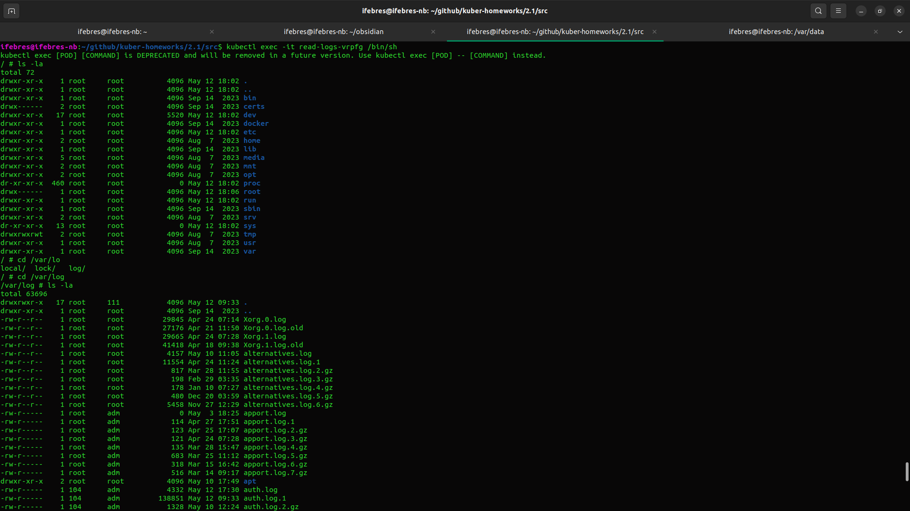
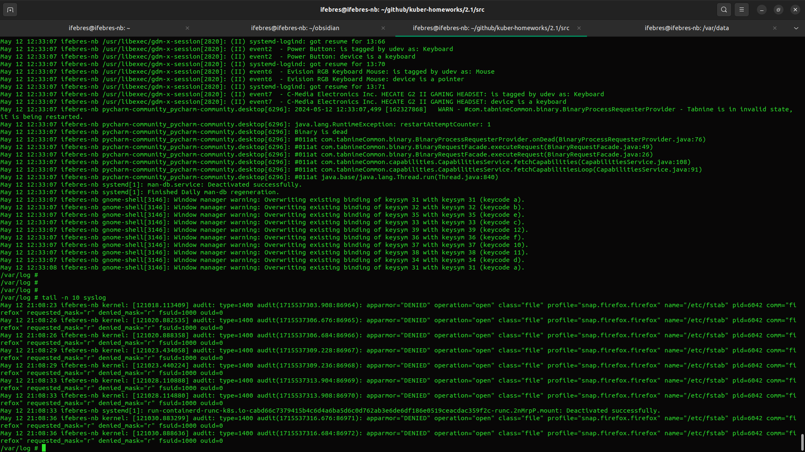

# Домашнее задание к занятию «Хранение в K8s. Часть 1»


### Задание 1 

**Что нужно сделать**

Создать Deployment приложения, состоящего из двух контейнеров и обменивающихся данными.

1. Создать Deployment приложения, состоящего из контейнеров busybox и multitool.[data-sharing-pod.yaml](src%2Fdata-sharing-pod.yaml)
```commandline
ifebres@ifebres-nb:~/github/kuber-homeworks/2.1/src$ kubectl exec -it data-sharing-pod-6f989cbd78-n9kc8 -c multitool -- cat /shared-multitool/data.txt
Sun May 12 17:46:48 UTC 2024
Sun May 12 17:46:53 UTC 2024
Sun May 12 17:46:58 UTC 2024
Sun May 12 17:47:03 UTC 2024
Sun May 12 17:47:08 UTC 2024
Sun May 12 17:47:13 UTC 2024
Sun May 12 17:47:18 UTC 2024
Sun May 12 17:47:23 UTC 2024
Sun May 12 17:47:28 UTC 2024
Sun May 12 17:47:33 UTC 2024
Sun May 12 17:47:38 UTC 2024
Sun May 12 17:47:43 UTC 2024
```

------

### Задание 2

**Что нужно сделать**

Создать DaemonSet приложения, которое может прочитать логи ноды.

1. Создать DaemonSet приложения, состоящего из multitool. [read-logs-daemonset.yaml](src%2Fread-logs-daemonset.yaml)
```commandline
ifebres@ifebres-nb:~/github/kuber-homeworks/2.1/src$ kubectl apply -f read-logs-daemonset.yaml 
daemonset.apps/read-logs created
ifebres@ifebres-nb:~/github/kuber-homeworks/2.1/src$ kubectl get pod
NAME                                READY   STATUS    RESTARTS   AGE
data-sharing-pod-7fcbc44555-786ck   2/2     Running   0          3m36s
read-logs-vrpfg                     1/1     Running   0          36s
ifebres@ifebres-nb:~/github/kuber-homeworks/2.1/src$ kubectl logs read-logs-vrpfg
May 12 21:02:36 ifebres-nb microk8s.daemon-containerd[33677]: time="2024-05-12T21:02:36.767262174+03:00" level=info msg="ImageUpdate event &ImageUpdate{Name:docker.io/wbitt/network-multitool:latest,Labels:map[string]string{io.cri-containerd.image: managed,},XXX_unrecognized:[],}"
May 12 21:02:36 ifebres-nb microk8s.daemon-containerd[33677]: time="2024-05-12T21:02:36.777357063+03:00" level=info msg="ImageUpdate event &ImageUpdate{Name:docker.io/wbitt/network-multitool@sha256:d1137e87af76ee15cd0b3d4c7e2fcd111ffbd510ccd0af076fc98dddfc50a735,Labels:map[string]string{io.cri-containerd.image: managed,},XXX_unrecognized:[],}"
May 12 21:02:36 ifebres-nb microk8s.daemon-containerd[33677]: time="2024-05-12T21:02:36.777998786+03:00" level=info msg="PullImage \"wbitt/network-multitool:latest\" returns image reference \"sha256:713337546be623588ed8ffd6d5e15dd3ccde8e4555ac5c97e5715d03580d2824\""
May 12 21:02:36 ifebres-nb microk8s.daemon-containerd[33677]: time="2024-05-12T21:02:36.779123228+03:00" level=info msg="CreateContainer within sandbox \"dc9c0bd2de0c5bdb91ce81ad634738b16320d73ce4c71107873762acf713c930\" for container &ContainerMetadata{Name:multitool,Attempt:0,}"
May 12 21:02:36 ifebres-nb kernel: [120671.044593] audit: type=1400 audit(1715536956.846:86748): apparmor="DENIED" operation="open" class="file" profile="snap.firefox.firefox" name="/etc/fstab" pid=6042 comm="firefox" requested_mask="r" denied_mask="r" fsuid=1000 ouid=0

```


